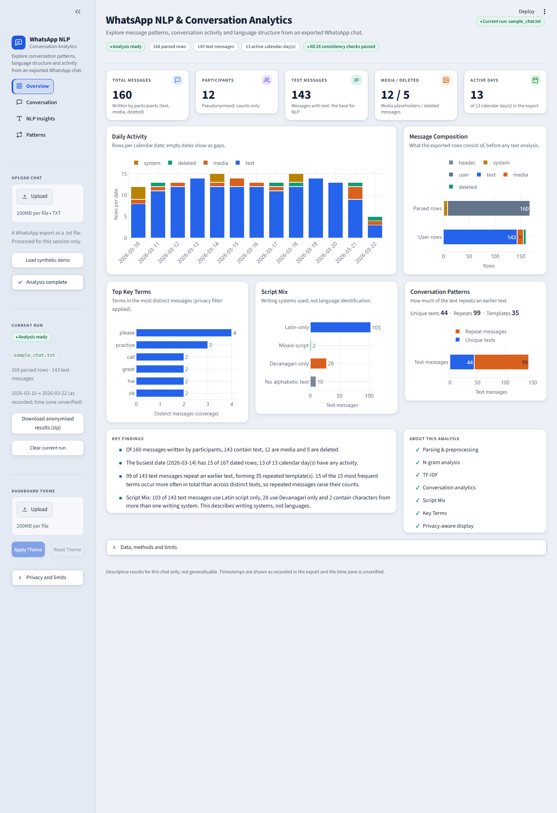
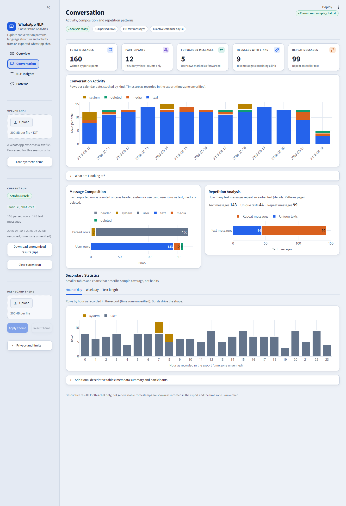
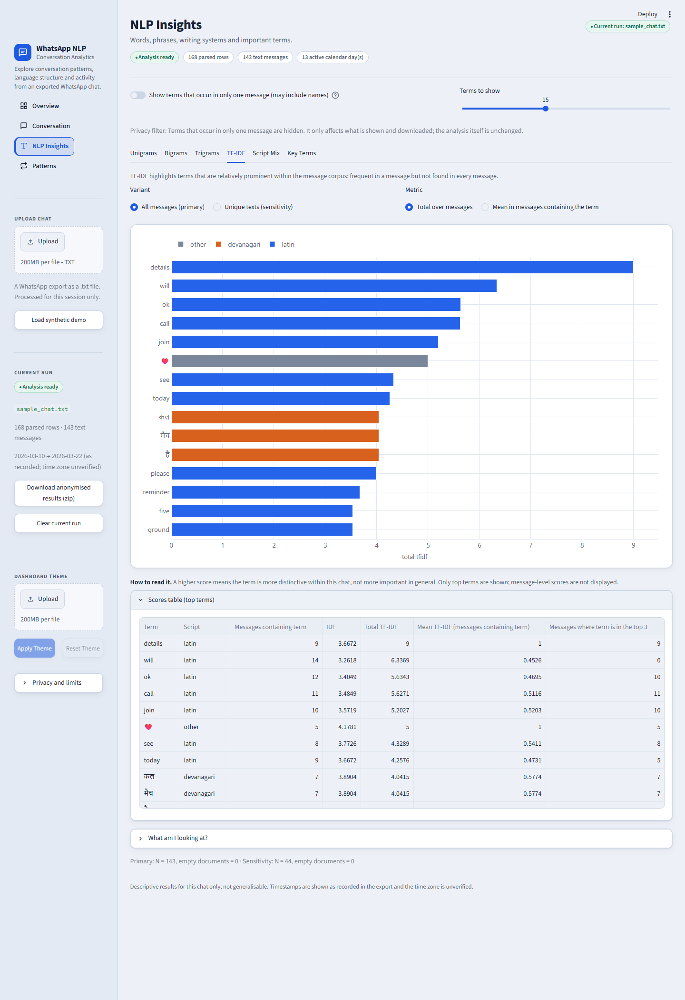
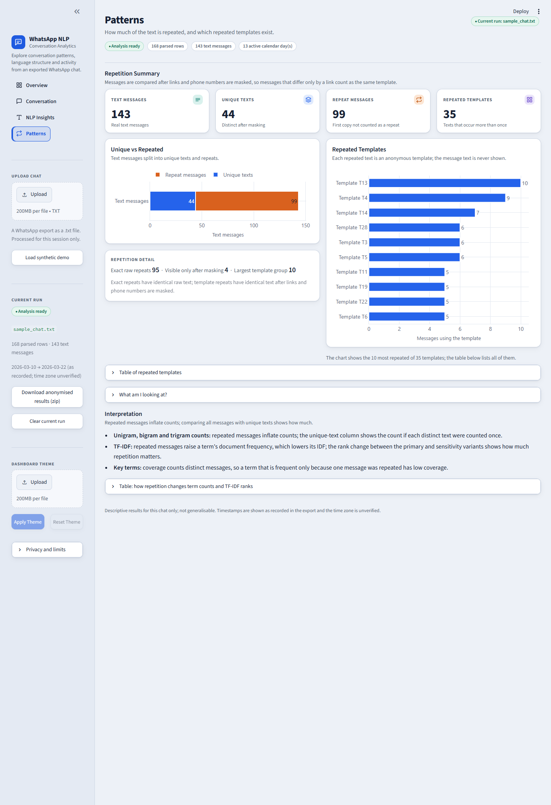
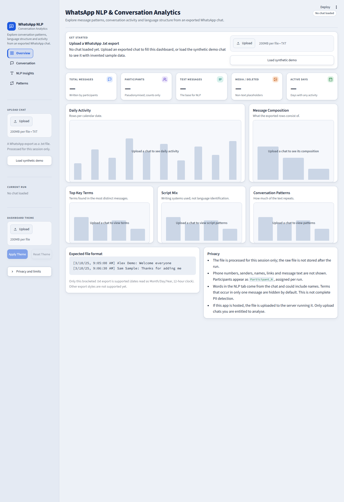

# WhatsApp NLP & Conversation Analytics

An MSc Data Science project: a reproducible pipeline and a Streamlit dashboard that describe the language and activity structure of
an exported WhatsApp chat, with privacy-aware display and download. It is an academic project, not a commercial product.

> **Privacy first.** No real chat is part of this repository. All example data are **fictional**. A real chat you upload is processed
> in a temporary folder that is deleted afterwards; the dashboard shows only anonymised, display-filtered tables.

## 1. Problem statement

A WhatsApp export is a semi-structured text file mixing messages, system events, media placeholders, several scripts (English, Devanagari,
romanised text), repeated announcements and personal data. Typical "chat analysers" count words and senders without checking whether the
numbers mean anything. This project asks: **what can be described reliably about one exported chat, and what must be left out or
qualified?** Every analysis therefore carries its definition, its denominator and its limitation.

## 2. Objectives

1. Parse an export robustly (multi-line messages, system rows, placeholders, invisible marks) and validate the result.
2. Describe vocabulary with n-grams and TF-IDF, treating repeated messages explicitly instead of hiding their effect.
3. Describe conversation structure (activity, composition, repetition) with counts that reconcile with each other.
4. Describe writing systems (Script Mix) without claiming language identification.
5. Protect privacy in every displayed and downloadable table.
6. Make everything reproducible, tested and honest about limitations.

## 3. Key features

* Parser for one precisely defined export format (see section 7), with data-quality checks.
* Unigrams, bigrams, trigrams (all messages vs unique texts), TF-IDF (two variants + stability diagnostic), Key Terms (coverage by distinct messages).
* Conversation analytics: row composition, daily activity, media/deleted/forwarded/link counts, repetition templates, hour/weekday/length tables, 28 reconciliation checks.
* Script Mix: Latin / Devanagari / mixed / other / no-letters per message (**script, not language**).
* Streamlit dashboard (light, soft analytics design) with four pages, optional theme image, anonymised download.
* Command-line pipeline, synthetic fixtures, an automated test suite and an optional real-browser smoke test.

## 4. Architecture

```
upload (.txt)
   │  validate (type, size, UTF-8, format, date order, limits)         src/run_pipeline.py
   ▼
parse → preprocess → quality checks                                    src/preprocessor.py
   ▼
 n-grams ─ TF-IDF ─ Script Mix ─ Key Terms ─ conversation analytics    src/*_analysis.py, key_terms.py, conversation_analytics.py
   ▼   (temporary folder, deleted afterwards; only whitelisted tables are loaded)
display privacy filter                                                 src/display_privacy.py
   ▼
dashboard pages  ·  anonymised zip download                            app/, src/results_bundle.py
```

The dashboard is a presentation layer: it computes nothing itself. `scripts/run_full_pipeline.py` runs the same modules from the
command line and writes every output (including internal tables) to a folder you choose.

## 5. Installation

Developed and tested on Python 3.12 (Windows). Create an environment and install the runtime dependencies:

```bash
python -m venv .venv
.venv\Scripts\activate            # Windows;  source .venv/bin/activate on Linux/macOS
pip install -r requirements.txt   # pandas, numpy, streamlit, plotly, pillow
pip install -r requirements-dev.txt   # adds pytest and scikit-learn (tests / TF-IDF cross-check)
```

## 6. How to run

```bash
streamlit run app/streamlit_app.py                                   # dashboard
python scripts/run_full_pipeline.py --input data/sample_chat.txt --out results/latest --summary   # command line
python -m pytest -q                                                  # tests
python scripts/check_repo_privacy.py                                 # scan files Git would commit
```

**Upload a chat:** open the dashboard, use *Upload chat* in the sidebar (a `.txt` export in the supported format), or press
*Load synthetic demo* to see the dashboard with invented data. Only the current successful run is kept; a failed upload leaves the
previous run on screen with a short explanation.

**Dashboard pages**

| Page | Content |
|---|---|
| Overview | Four KPI cards, daily activity, message composition, key findings (only from the run's own tables), methods checklist |
| Conversation | Activity timeline, composition, repetition, hour/weekday/text-length tables, metadata and participant counts |
| NLP Insights | Six tabs: Unigrams, Bigrams, Trigrams, TF-IDF, Script Mix, Key Terms, each with a short explanation and its limitation |
| Patterns | Repetition summary and anonymous "Template T1…" ids (message text is never shown) |

*Dashboard theme* (sidebar): optional PNG/JPG/WEBP image whose colours restyle the (always light and readable) interface. It lives only in the
browser session, is never stored, analysed or downloaded, and cannot change any result.

## Screenshots

All screenshots use the **fictional** sample chat `data/sample_chat.txt` (12 invented participants); no real chat is shown.

| | |
|---|---|
| **Overview** |  |
| **Conversation** |  |
| **NLP Insights: TF-IDF** |  |
| **Patterns** |  |
| **Empty state (before a chat is loaded)** |  |

## 7. Supported WhatsApp format

Only this export format is supported (details, placeholders and unsupported formats: [`docs/supported_formats.md`](docs/supported_formats.md)):

```
[M/D/YY, H:MM:SS AM/PM] Sender: message          dates read as Month/Day/Year, 12-hour clock, UTF-8 text
```

**Not supported:** Android "date, time - Sender: text" exports (no brackets), 24-hour clocks, timestamps without seconds, four-digit years,
Day/Month/Year dates. Support for iOS-style conventions was verified only on fictional fixtures; no real iOS export was available.
The app does not claim universal WhatsApp support.

## 8. NLP methodology (summary)

| Analysis | Input → output | Interpretation / limitation |
|---|---|---|
| Preprocessing | Lower-casing, invisible marks removed, whitespace tokens with punctuation stripped at the edges (ASCII and Unicode, e.g. the Devanagari danda), curly quotes normalised | Whitespace tokenisation; English-only stopwords; no stemming, no language identification |
| N-grams | Counts per message (never across messages) for unigrams (stopwords removed), bigrams, trigrams; each counted over **all messages** and over **unique texts** | The ratio shows how much repetition inflates a count |
| TF-IDF | tf × (ln((1+N)/(1+df))+1), L2-normalised per message; primary (all) and sensitivity (unique) variants; leave-one-out stability diagnostic (full for ≤200 messages, otherwise sampled and labelled) | "Distinctive within this chat", not "important"; unstable for small N |
| Key Terms | Terms ranked by the number of distinct messages containing them | Coverage vs total frequency; descriptive |
| Script Mix | Unicode letter names → Latin / Devanagari / other per word; message classes and alternations | **Not language identification**: Devanagari may be Marathi or Hindi, Latin may be English or romanised text |
| Conversation analytics | Counts with explicit denominators, repetition by masked-template identity, zero-filled daily calendar | Descriptive; timestamps as recorded, time zone unknown; no per-participant comparison |

## 9. Privacy approach

* Phone numbers (international and local formats), links (including bare WhatsApp invite links), e-mail and web addresses are replaced by placeholders before any term is formed.
* Participants appear as `Participant_N`, assigned per run with no stored mapping. System-message text is reduced to four generic categories. Repeated texts are shown only as `Template T1…`.
* Terms occurring in only one message are hidden by default; terms that look like links, addresses or long digit runs are always dropped.
* Internal tables (`processed_chat.csv`, `analysis_corpus.csv`, `tfidf_terms_by_message.csv`, `key_terms.csv`) are never displayed or downloaded.
* **Privacy filtering is a precautionary display/download layer and is not a complete PII detector.** A name that occurs in several messages is still shown.

## 10. Testing

`python -m pytest -q` runs the whole suite: **304 tests, 304 passed, 0 failed, 0 skipped** on the final run with
`requirements-dev.txt` installed (without scikit-learn, 2 cross-check tests are skipped by design; `docs/final_verification.md`). Generic tests use fictional chats in `tests/fixtures/`; an optional, local-only regression test for a private development chat is **not** part of the repository (it is git-ignored and skipped when `data/chat.txt` is absent). `scripts/browser_smoke_test.py` (optional, needs Playwright and Edge/Chromium)
drives the dashboard with the fictional chats and saves screenshots.

## 11. Limitations

* Only the format in section 7; time zone unknown; day/month order cannot be verified when every value is 12 or below.
* English-only stopwords: Roman Hindi/Marathi and Devanagari function words can dominate rankings.
* Small chats give unstable rankings; the dashboard warns below 50 text messages.
* Pattern-based privacy masking can miss unusual formats; names in message text are not detected.
* The TF-IDF stability diagnostic is sampled above 200 messages; the default analysis limit is 1,000 text messages (configurable).
* Real iOS exports and very large chats were not verified. Visual checks were done in Microsoft Edge only.

## 12. Future work (not implemented)

Sentiment and emotion analysis (a feasibility study found no verified model covering English + Hindi + Marathi + code-mixing; see `docs/emotion_sentiment_design.md`),
named-entity recognition, language identification, Android and other export formats, Marathi/Hindi stopword resources, reply-network analysis.

## 13. Project structure

```
app/                 Streamlit dashboard (streamlit_app.py, views.py, ui.py, charts.py, theme.py)
src/                 Pipeline modules, privacy filter, bundle builder, run manager, configuration
tests/               Test suite; tests/fixtures/ = fictional chats
scripts/             run_full_pipeline.py, generate_synthetic_fixtures.py, check_repo_privacy.py, browser_smoke_test.py, benchmark_pipeline.py
docs/                Design notes, supported formats, audit fixes, final verification; docs/images = README screenshots (fictional data)
notebooks/           Parsing and preprocessing walkthrough on the fictional sample
data/                sample_chat.txt (fictional); real exports stay local and are ignored by Git
results/             results/sample = output of the fictional sample; everything else ignored
.streamlit/          Theme and server configuration
```

## 14. Example and synthetic data policy

All committed chats are invented: names such as "Alex Demo", numbers such as `+91 90000 12345`, links such as `example.com`. They are generated by
`scripts/generate_synthetic_fixtures.py` (fixed seeds) or written by hand. Never commit a real export, a screenshot of one, or a file derived
from one; `.gitignore` and `scripts/check_repo_privacy.py` guard this.

## 15. Academic project note

Prepared for an MSc Data Science programme. The scope is deliberately limited and descriptive. The results describe each uploaded chat only
and are not generalisable statements about people or groups. See `docs/` for the design notes and `docs/final_verification.md` for what was tested.

Licence: MIT (see `LICENSE`).
